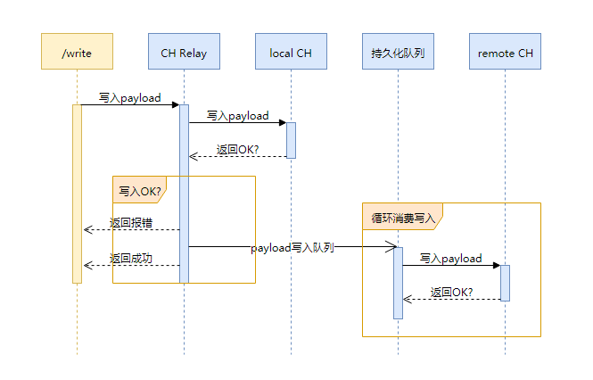

Clickhouse Relay
=====

This project adds a basic high availability layer to clickhouse. With the right architecture and disaster recovery processes, this achieves a highly available setup.

*NOTE:* `clickhouse-relay` must be built with Go 1.5+

## Usage

To build from source and run:

```sh
$ # Install clickhouse-relay to your $GOPATH/bin
$ go get -u github.com/stitchcula/clickhouse-relay
$ # Edit your configuration file
$ cp $GOPATH/src/github.com/stitchcula/clickhouse-relay/sample.toml ./relay.toml
$ vim relay.toml
$ # Start relay!
$ $GOPATH/bin/clickhouse-relay -config relay.toml
```

## Configuration

```toml
[[http]]
# Name of the HTTP server, used for display purposes only.
name = "example-http"

# TCP address to bind to, for HTTP server.
bind-addr = "127.0.0.1:8123"

# Enable HTTPS requests.
ssl-combined-pem = "/etc/ssl/clickhouse-relay.pem"

# Persistent buffer path
buffer-dir = "/opt/data/clickhouse-relay"

# Array of InfluxDB instances to use as backends for Relay.
output = [
    # name: name of the backend, used for display purposes only.
    # location: full URL of the /write endpoint of the backend
    # timeout: Go-parseable time duration. Fail writes if incomplete in this time.
    # skip-tls-verification: skip verification for HTTPS location. WARNING: it's insecure. Don't use in production.
    { name="local1", location="http://127.0.0.1:8234", timeout="10s" },
    { name="local2", location="http://127.0.0.1:8456", timeout="10s" },
]
```

## Description

The architecture is fairly simple and consists of a load balancer, two or more InfluxDB Relay processes and two or more InfluxDB processes. The load balancer should point UDP traffic and HTTP POST requests with the path `/write` to the two relays while pointing GET requests with the path `/query` to the two InfluxDB servers.

The setup should look like this:



## Buffering

The relay can be configured to buffer failed requests for HTTP backends.

Buffering has the following configuration options (configured per HTTP backend):

* buffer-dir -- Persistent buffer path
